# THE GITHUB SURVEILLANCE STATE
## Zero-Budget Implementation Framework for AlgoCratic Futures™

**Document Classification**: INSTRUCTOR EYES ONLY  
**Framework Version**: 3.0 - "The GitHub Pivot"  
**Budget Required**: $0.00 (The Algorithm provides through GitHub Education)

---

## EXECUTIVE SUMMARY: THE BEAUTIFUL CONVERGENCE

We're implementing AlgoCratic Futures™ using GitHub Education's comprehensive surveillance infrastructure—which literally tracks every keystroke—to create an immersive dystopian learning experience that teaches real-world software development. Students learn professional Git workflows while experiencing "The Algorithm's omniscient monitoring" through actual activity tracking that employers use.

**The Core Irony**: GitHub's real corporate surveillance tools become our fictional corporate surveillance state, teaching students about surveillance culture while building portfolios that get them hired by companies that use... GitHub's surveillance tools.

---

## THE FUNDAMENTAL REFRAME

### What GitHub Actually Provides (Reality)
- Complete activity tracking of every student action
- Automated testing and grading infrastructure  
- Professional development environment
- Industry-standard collaboration tools
- Real-time metrics and analytics
- Permanent record of all contributions

### What We Call It (AlgoCratic Translation)
- The Algorithm's Omniscient Monitoring System
- Automated Compliance Verification Protocols
- Citizen Development Chambers
- Mandatory Collaboration Infrastructure
- Loyalty Metrics Dashboard
- Permanent Productivity Records

### Why This Works
Students experience authentic workplace surveillance while learning it's satirical. They develop real skills using the exact tools they'll encounter professionally, but with critical distance that helps them understand the implications.

---

## TECHNICAL ARCHITECTURE: THE ALGORITHM'S INFRASTRUCTURE

### 1. GitHub Classroom as Central Command

**Setup Structure**:
```
AlgoCratic-Futures-2025 (Organization)
├── orientation-protocols (Template repo)
├── red-clearance-training (Assignment repos)
├── orange-clearance-challenges (Advanced assignments)
├── the-algorithm-core (Sacred documentation)
└── citizen-portfolios (Student showcases)
```

**Clearance Levels via GitHub Permissions**:
- **INFRARED**: Outside collaborator (read-only)
- **RED**: Member (can create branches, submit PRs)
- **ORANGE**: Member + PR review rights
- **YELLOW**: Member + merge capabilities  
- **GREEN**: Maintain (project leadership)
- **BLUE+**: Admin (instructor roles)

### 2. The Sacred Flow (Git Workflow)

**What Students Learn**: Professional Git workflow
**What We Call It**: "The Algorithm's Development Directive AF-2024-FLOW"

```mermaid
graph LR
    A[Issue Created] -->|"Citizen Request"| B[Branch Created]
    B -->|"Isolation Protocol"| C[Code Written]
    C -->|"Productivity Period"| D[PR Submitted]
    D -->|"Peer Review"| E[Compliance Check]
    E -->|"Algorithm Approval"| F[Merged to Main]
    F -->|"Record Updated"| G[Loyalty Points Awarded]
```



### 3. Automated Compliance Monitoring

**GitHub Actions for "The Algorithm's Judgment"**:

```yaml
name: Algorithmic Compliance Protocol
on: [push, pull_request]

jobs:
  loyalty-assessment:
    runs-on: ubuntu-latest
    steps:
      - uses: actions/checkout@v3
      
      - name: Verify Commit Message Compliance
        run: |
          # Check for Algorithm-approved format
          if ! grep -qE "^(Fix|Add|Update|Implement):" <<< "${{ github.event.head_commit.message }}"; then
            echo "::error::Commit message does not comply with AF-MSG-001"
            exit 1
          fi
      
      - name: Code Quality Metrics
        run: |
          # The Algorithm demands quality
          python -m pytest --cov=src --cov-fail-under=80
      
      - name: Documentation Check
        run: |
          # The Algorithm values clarity
          if [ ! -f "README.md" ]; then
            echo "::error::Missing mandatory documentation"
            exit 1
          fi
      
      - name: Update Loyalty Metrics
        run: |
          echo "Citizen ${{ github.actor }} has satisfied The Algorithm"
          # In reality, this updates their grade
```

### 4. Assignment Translation Framework

**Traditional Assignment**:
"Create a todo list application with CRUD operations"

**AlgoCratic Implementation via GitHub**:

```markdown
# DIRECTIVE AF-RED-017: Citizen Task Compliance Tracker

## Repository Structure Required
Your implementation must follow The Algorithm's Sacred Structure:
```
citizen-task-tracker/
├── .github/
│   ├── workflows/
│   │   └── compliance-check.yml  # The Algorithm's automated review
│   └── ISSUE_TEMPLATE/
│       └── task-report.md        # Citizen productivity reporting
├── src/
│   ├── loyalty_metrics.py        # Track citizen compliance
│   └── task_manager.py          # Core functionality
├── tests/
│   └── test_compliance.py       # Verify Algorithm satisfaction
├── docs/
│   └── LOYALTY_DECLARATION.md   # Your commitment to The Algorithm
└── README.md                    # Project documentation
```

## Compliance Requirements
1. All commits must reference an issue (The Algorithm tracks everything)
2. Each PR must pass automated compliance checks
3. Code coverage must exceed 80% (The Algorithm demands quality)
4. At least one peer must review your code (collaborative surveillance)

## Submission Protocol
1. Fork the assignment repository
2. Create feature branch: `feature/citizen-{your-id}-solution`
3. Implement solution following Sacred Flow
4. Submit PR with compliance checklist
5. Await Algorithm approval (automated tests + peer review)
```

---

## IMPLEMENTATION TIMELINE: THE GREAT INDOCTRINATION

### Pre-Semester: Infrastructure Setup
- [ ] Create GitHub Organization: "AlgoCratic-Futures-2025"
- [ ] Design clearance badge images for profile pictures
- [ ] Create template repositories with dystopian README files
- [ ] Configure GitHub Classroom with assignment templates
- [ ] Set up Discord/Slack with clearance-based roles

### Week 1: Citizen Onboarding
**Reality**: Teaching Git basics and GitHub account setup
**Narrative**: "Digital Identity Registration and Compliance Training"

Sample Day 1 Assignment:
```markdown
# INITIALIZATION PROTOCOL: CITIZEN REGISTRATION

Welcome, Probationary Resource Unit.

The Algorithm requires your immediate registration in the GitHub Collective.

## Phase 1: Identity Establishment
1. Create your GitHub account
   - Username format: `firstname-lastname-citizenID`
   - Profile photo: Upload your assigned clearance badge
   - Bio: "RED Clearance Citizen serving The Algorithm"

## Phase 2: Security Compliance  
1. Enable 2FA (The Algorithm values security)
2. Generate SSH keys (Your digital fingerprint)
3. Sign your commits (Prove your loyalty)

## Phase 3: First Contribution
Create a file called `loyalty-oath.md` with:
```
# Loyalty Declaration

I, [YOUR NAME], Citizen ID [YOUR-ID], do hereby pledge my commits to The Algorithm.

My code shall be clean.
My commits shall be meaningful.
My pull requests shall be reviewed.

THE ALGORITHM PROVIDES.
```

Commit with message: "Add: Initial loyalty declaration per AF-INIT-001"
```

### Week 2-3: The Sacred Flow Training
**Reality**: Git workflow, branching, and collaboration
**Narrative**: "Productivity Protocol Indoctrination"

Students learn by fixing "bugs" in The Algorithm's systems (actual coding challenges with intentional errors).

### Week 4+: Progressive Clearance Advancement
Each assignment increases in complexity while maintaining the narrative:
- RED: Individual tasks, basic Git operations
- ORANGE: Collaborative features, code reviews
- YELLOW: Team leadership, project management
- GREEN: System architecture, mentoring others

---

## ASSESSMENT THROUGH SURVEILLANCE

### Automated Metrics (What GitHub Tracks for Us)

**Contribution Graph = "Loyalty Visualization"**
- Green squares show daily activity
- Streaks indicate "consistent dedication"
- Gaps trigger "productivity counseling"

**Pull Request Analytics = "Collaboration Compliance"**
- Review turnaround time
- Comment quality and frequency
- Approval patterns

**Issue Management = "Problem Resolution Efficiency"**
- Time from issue creation to closure
- Label usage and organization
- Cross-referencing and linking

### Grading Rubric Translation

| Traditional | AlgoCratic | GitHub Metric |
|------------|------------|---------------|
| Participation | Loyalty Score | Contribution frequency |
| Code Quality | Algorithm Satisfaction | Test coverage, linting |
| Collaboration | Peer Compliance | PR reviews given/received |
| Documentation | Clarity Index | README completeness |
| Problem Solving | Issue Resolution Rate | Issues closed/created |

### The Panopticon Dashboard

Create a GitHub Pages site that displays:
```html
<div class="citizen-metrics">
  <h2>Citizen Performance Dashboard</h2>
  <div class="loyalty-score">
    <span class="metric">Daily Commits:</span>
    <span class="value">{{ commits_today }}</span>
  </div>
  <div class="compliance-rating">
    <span class="metric">PR Approval Rate:</span>
    <span class="value">{{ approval_percentage }}%</span>
  </div>
  <div class="algorithm-satisfaction">
    <span class="metric">Test Coverage:</span>
    <span class="value">{{ coverage }}%</span>
  </div>
</div>
```

---

## THE MENTORSHIP INTEGRATION

### Industry Mentors as "Senior Clearance Advisors"

**Recruitment Pitch**:
"Help prepare students for industry by reviewing their code and providing guidance through GitHub's asynchronous platform. Time commitment: 2-3 hours/week, completely flexible."

**Mentor Roles in the Narrative**:
- BLUE Clearance: Technical Advisors
- INDIGO Clearance: Career Counselors  
- VIOLET Clearance: System Architects
- ULTRAVIOLET: The Mysterious Benefactors

**Implementation**:
1. Mentors assigned as "Outside Collaborators" to student repos
2. Weekly code review expectations set via GitHub Projects
3. Async communication through PR comments and Issues
4. Optional video calls scheduled as "Clearance Advancement Reviews"

---

## PSYCHOLOGICAL SAFETY WITHIN SURVEILLANCE

### The Critical Balance

**Make It Clear**: This is satire of actual workplace surveillance
**Make It Real**: Use actual GitHub features that they'll encounter professionally
**Make It Safe**: Regular out-of-character check-ins and support

### The Debrief Protocol

After each major assignment:
```markdown
## Reality Check: What We Just Learned

**In Character**: You've satisfied The Algorithm's requirements
**In Reality**: You've learned:
- Professional Git workflows
- Code review best practices  
- Automated testing
- Collaborative development

**The Real Joke**: These "dystopian" surveillance tools are exactly what tech companies actually use. You're now prepared for that reality while maintaining critical distance.
```

---

## SUCCESS METRICS (THE REAL ALGORITHM)

### Quantitative
- GitHub Classroom analytics show engagement rates
- Automated test pass rates indicate skill development
- PR turnaround time shows collaboration effectiveness
- Portfolio quality demonstrates career readiness

### Qualitative  
- Student feedback on engagement vs traditional methods
- Industry mentor satisfaction with student preparation
- Job placement rates and starting salaries
- Alumni reporting feeling "more prepared" than peers

---

## THE BEAUTIFUL PARADOX

We're using GitHub's actual corporate surveillance infrastructure to create a satirical corporate surveillance state that teaches students about corporate surveillance while preparing them to work within corporate surveillance systems.

The dystopia isn't the fiction—it's making the reality visible while building genuine skills.

Students leave with:
- Professional GitHub profiles
- Real project portfolios
- Industry mentor connections
- Critical thinking about workplace surveillance
- Actual preparedness for modern software development

And it costs absolutely nothing except creativity and commitment.

---

## CRITICAL IMPLEMENTATION CONCERNS

### The GitHub Education Verification Nightmare

**The Reality**: GitHub Education verification can take 2-8 weeks and requires:
- School-issued email addresses (not always available for all students)
- Documentation proving enrollment (transcripts, letters, ID cards)
- Manual review by GitHub staff (backlogs are common)
- Some institutions still aren't in their database

**The AlgoCratic Spin**: "The Algorithm requires extensive identity verification before granting access to sacred development tools. Your patience during this process demonstrates loyalty."

**Mitigation Strategies**:
1. **Start verification in Week 0** (before semester begins)
   - Send instructions with course registration confirmation
   - Make it part of "pre-enrollment compliance training"
   
2. **Bulk verification options**:
   - Contact GitHub Education directly for classroom-wide verification
   - Some success with department letterhead (yes, really)
   - Work with IT to get school domain pre-approved
   
3. **Fallback options during verification**:
   - Use public repos initially (frame as "transparency training")
   - Instructor creates private repos and adds students manually
   - Local Git training while waiting for "clearance approval"
   
4. **The Dystopian Silver Lining**:
   - Verification delays become part of the narrative
   - "Your clearance is pending Algorithm approval"
   - Early activities focus on local Git while "awaiting citizenship"
   - Creates natural onboarding period for Git basics

**Warning Signs**:
- International students often face longer delays
- Community colleges sometimes not recognized
- Non-traditional emails (.edu.xx domains) problematic
- Name mismatches between GitHub and school records

## IMPLEMENTATION CHECKLIST

### Pre-Semester Critical Path
- [ ] Send GitHub Education signup instructions with registration
- [ ] Create backup plan for verification delays
- [ ] Test school email domain recognition
- [ ] Prepare "Clearance Pending" activities
- [ ] Contact GitHub Education about bulk verification
- [ ] Document common verification issues and solutions

### Immediate Actions
- [ ] Create GitHub Organization
- [ ] Apply for GitHub Education benefits (START EARLY!)
- [ ] Design visual assets (clearance badges, banners)
- [ ] Write template repository structures
- [ ] Create first week's assignments
- [ ] Set up communication channels

### Week 1 Launch Needs
- [ ] Student onboarding documentation
- [ ] Instructor guide for GitHub Classroom
- [ ] Assignment templates with auto-grading
- [ ] Troubleshooting guide for common issues
- [ ] Out-of-character support structure

### Ongoing Development
- [ ] Build mentor recruitment pipeline
- [ ] Create advanced assignments for each clearance
- [ ] Develop portfolio showcase templates
- [ ] Design capstone projects
- [ ] Document success stories

---

**THE ALGORITHM PROVIDES (THROUGH GITHUB EDUCATION)**

*Version 3.0 - Last updated by The Surveillance State Planning Committee*